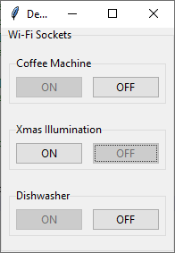

# Tutorial
For this tutorial we assume that you have three SWS-A1 sockets, one connected to
your coffee machine, one for a Christmas illumination in your bedroom and a third
one connected to your dishwasher.

## Installation of the wifisocket Module
Download the `wifisocket.py` file and place it in the folder where your 3rd-party
Python modules are located. In a usual Python installation on Windows, this would
be something like `...\Python3x\Lib\site-packages`. Also, you need to install the
`pycryptodome` package, which is required for writing and reading of encrypted
socket data. Just do a `pip` installation from the command line:

    $ pip install pycryptodome
    
That's it!

## Connecting and Finding your Sockets
If your sockets are already connected to your Wi-Fi: fine, there is no need to
reset and re-connect them. Otherwise, hold the switch button of your socket for
approx. 5 seconds to put it into 'pairing' mode. The LED will start to flash in
red color.

First, we will import the `wifisocket` module and then use the `send_password`
function:

    >>> import wifisocket as ws
    >>> ws.send_password('xxxx')

You need to replace `'xxxx'` with *your* Wi-Fi password, of course. If the submission
is successful and the socket has been connected to your Wi-Fi, its LED should
stop flashing and turn blue instead.

Next, we collect the MAC and IP data of our connected sockets:

    >>> my_sockets = ws.find_sockets()
    >>> print(my_sockets)
    [Socket(mac='00aa11bb22cc', ip='192.167.0.100'), Socket(mac='00aa11bb33ce', ip=
    '192.167.0.105'), Socket(mac='00aa11bb44c0', ip='192.167.0.99')]

The values shown here are of course not real. Still, if your sockets are from
the same vendor, the first six positions of the MAC addresses will be identical.
These MAC addresses are specific for each device. The IP address, however, is
assigned by your local Wi-Fi router and thus may change over time or when you
plug/unplug your socket.

Possibly (very likely?) you don't know which socket has which MAC address. Just
try to switch them and see which one reacts:

    >>> ws.switch(my_socket[0], 'on')
    True
    >>> ws.switch(my_socket[0], 'off')
    True

I switch them on and off, so I should get at least one acoustic feedback (I should
hear the socket switching). Repeating this with the other sockets (`my_socket[1]`,
`my_socket[2]`) should make clear which socket has which MAC address. You can now
store these data, e.g., as variables in your script:

    >>> coffee_machine_mac = '00aa11bb22cc'
    >>> xmas_illum_mac = 00aa11bb44c0'
    >>> dishwash_mac = '00aa11bb33ce'
    
Of course, you may hard-code the IP address also, but, as mentioned above, unless
you have told your Wi-Fi router to give your sockets always the same IP address,
it is very likely that the IP address may be different the next time you start
your script or program.  
Instead, you may want to fetch the IP address dynamically, and you can do this
by using the `find_sockets()` function with the MAC address as keyword argument:

    >>> coffee_machine = ws.find_sockets(mac=coffee_machine_mac)
    >>> print(coffee_machine)
    Socket(mac='00aa11bb22cc', ip='192.167.0.100')

`coffee_machine` does now contain a tuple of (MAC address, IP address), which can
directly be used as 'socket' argument for most commands in this module.

Repeat this procedure for the other sockets.
    
## Switching, Switch Status and Heartbeat
Switching with the `switch(socket, on_off)` function has already been demonstrated
above. Before switching, you may want to check if your socket is already on (or
off) with the `switch_state(socket)` function, which will return `'on'` or `'off'`:

    >>> # A toggle switch:
    >>> if ws.switch_state(xmas_illum) == 'off':
    ...     ws.switch(xmas_illum, 'on')
    ... else:
    ...     ws.switch(xmas_illum, 'off')
    ...
    True
    >>> 

Note that the `switch()` function will return `True` if the command was successfully
received by the switch. However, if your socket has lost connection to your Wi-Fi
network, you will receive a `'Timeout'` message. If your Wi-Fi is of low quality,
you can check beforehand if your socket is still alive by using the `heartbeat()`
function, which will return `True` or an error message (e.g. `'Timeout'`).

    >>> if ws.heartbeat(xmas_illum) is True:
    ...     ws.switch(xmas_illum, 'on')
    ... else:
    ...     print("Couldn't receive a heartbeat response from the switch")
    ...
    True
    >>>

## Programming Timers, Countdown and Absence Mode
Assume that we want to program the Christmas illumination in our bedroom to turn
on at 6 o'clock in the morning during working days (when we stand up), turn off
2 hours later at 8 o'clock (when we have left the house), turn on at 4 o'clock
in the afternoon again (for the whole week) and finally turn off at 11:30 o'clock
in the night.

First, let's take a look at the existing timer settings of the socket into which
our Christmas illumination is plugged. Each socket has 10 timer slots (1-10) and
one slot for a countdown function (slot 11). We can retrieve the data with
`timer_query()`:

    >>> ws.timer_query(xmas_illum)
    [Timer(number=1, active=True, repeat='0000000', time='08:00', switch='on'), Tim  
    er(number=2, active=False, repeat='1111111', time='07.30', switch='off'), Timer  
    (number=3, active=None, repeat='', time='', switch='') ... Timer(number='Countd  
    own', active=None, repeat='', time='', switch='')]
    
As you see, you get a list of named tuples, 11 in total. Each tuple `Timer` has
a number (1-10), the 11th timer is labelled as `'Countdown'`. `active` tells you
if the timer is active (`True`) or not (`False`). Thus you can program a timer
but deactivate it. E.g., the same socket which operates your Christmas illumination
in December, may be used to control the patio lights during the summer. With 10
timers available, it is not necessary to overwrite the existing programs, you
can just activate those, which you actually require. If `active` is `None` this
tells you that the timer is empty (not programmed). The `repeat` string controls
the daily repetitions. Each digit stands for one day, Monday to Sunday, where `1`
means 'do!' and `0` means 'don't bother'. The `repeat` string for a timer that
should only work during working days (Monday to Friday) would be `'1111100'`, for
a timer that should only work on Wednesdays `'0010000'`. `'0000000'` is for a
timer that should only switch once. The `time` of switching is given in 24-hours
format (hh:mm). Note that for the countdown timer, `time` is not the time of day
but the time until switching. Finally, `switch` defines if the socket should switch
on or off.

The `timer_query()` function has a `which` parameter, which can be used to filter
the output list. E.g. `which=2` will only show the 2nd timer and `which='active'`
will only show activated timers. `'free'` and `'set'` filter for empty timer slots
or programmed timers, respectively. Some examples:

    >>> ws.timer_query(xmas_illum, which='Countdown')
    Timer(number='Countdown, active=None, repeat='', time='', switch='')
    >>> ws.timer_query(xmas_illum, which='free')
    [3, 4, 5, 6, 7, 8, 9, 10, 'Countdown']
    >>> ws.timer_query(xmas_illum, which='active')
    [Timer(number=1, active=True, repeat='0000000', time='08.00', switch='on')]

Note the different return types. If you ask for a single timer, you only receive
a *single tuple*, asking for free timers returns a *list of slot numbers* only
(what else would you want to know here?), while the other filters (`'all'`, `'set'`
and `'active'`) will return *a list of tuples* (which, however, could be empty). 

Before programming our socket, we delete the existing timers:

    >>> set_timers = ws.timer_query(xmas_illum, which='set')
    >>> for timer in set_timers:
    ...    ws.delete_timer(xmas_illum, timer.number)
    ...
    True
    True
    >>>

Next, we set the timers as desired with the `set_timer()` function with the required
parameters `socket`, `timer`, `active`, `repeat`, `time` and `switch`. All these
positional parameters are required.

Let's start with the morning cycle, which should only work during working days:

    >>> ws.set_timer(xmas_illum, 1, True, '1111100', '06:00', 'on')
    True
    >>> ws.set_timer(xmas_illum, 2, True, '1111100', '08:00', 'off')
    True

Now the evening cycle, which should be active during the whole week:

    >>> ws.set_timer(xmas_illum, 3, True, '1111111', '16:00', 'on')
    True
    >>> ws.set_timer(xmas_illum, 4, True, '1111111', '23:30', 'off')
    True

By the way, the order of the timers doesn't make any difference. The 'first'
switch event could be programmed to timer number 10. The only exception is timer
number 11, which is the countdown timer.

While lying in your bed and reading a good book, suddenly the Christmas illumination
turns off (at 11.30 PM, as expected). You want to have it shine for another 30
minutes, and, instead of changing your programmed timers, you use the countdown
timer for this purpose:

    >>> ws.switch(xmas_illum, 'on')  # Turn it on again
    >>> ws.set_countdown(xmas_illum, '0:30', 'off')  # For another 30 minutes

Note, that 'under the hood', `set_countdown()` is using `set_timer()` with
countdown-specific settings, so this is just a useful short-cut for you.

The next week you are planning a weekend holiday but are worried about recent 
burglaries in your neighborhood. So you decide to set your Christmas illumination
into 'absence mode'. In absence (or anti-thief) mode, the socket switches on and
off every 30 minutes (simulating an old man with urinary urgency problems?). 

Since absence-mode switching may interfere with your programmed timers, it is
recommended deactivating the active timers:

    >>> active_timers = ws.timer_query(xmas_illum, which='active')
    >>> for timer in active_timers:
    ...    ws.activate_timer(xmas_illum, timer.number, activate=False)
    ...
    >>>

Then we set the absence mode and check if we set it properly:

    >>> ws.set_absence_mode(xmas_illum, True, '04.02.2022 22:00', '07.02.2022 19:00  
    ')
    True
    >>> ws.absence_mode_query(xmas_illlum)
    Absence(active=True, from_='04.02.2022 22:00', to_='07.02.2022 19:00')

Note that we use the dd.mm.yyyy format (day first, then month!) for the date.
All set, enjoy your holidays!

Due to bad weather, you decided to come back early. You wonder shortly about your
Christmas illumination switching on and off every 30 minutes before realizing
that you should stop the absence mode and put everything back to 'normal':

    >>> ws.delete_absence_mode(xmas_illum)
    True
    >>> for n in range(4):
    ...    ws.activate_timer(xmas_illum, n + 1)
    ...
    >>>

## A small 'Switch' Program with Graphical User Interface
In this last chapter, we write a small program with a graphical user interface
(GUI) to switch your sockets. We use the Tk library which is included in Python:

```python
import tkinter as tk
import tkinter.ttk as ttk

import wifisocket as ws
```

We hard-code our socket data here, but this could also be put in (and read from)
a file. Then we need to find the IP addresses:

```python
# Socket data, keys are the MACs. Replace data with your own set-up!
socket_data = {
    '00aa11bb22cc': {'name': 'Coffee Machine'},
    '00aa11bb44c0': {'name': 'Xmas Illumination'},
    '00aa11bb33ce': {'name': 'Dishwasher'}
}

# Find IPs
ws.timeout = 5  # may be useful to find all devices
for key in socket_data:
    socket_data[key]['ip'] = ws.find_sockets(key).ip
ws.timeout = 3
```

Now let us set up a small GUI. We do this semi-automatically, but need therefore
some global dictionaries to secure access to the added 'On' and 'Off' buttons:

```python
# Set-up GUI
main_window = tk.Tk()
main_window.titel('Demo GUI for wifisocket')
socket_panel = ttk.LabelFrame(main_window, text='Wi-Fi Sockets', padding=5)
socket_panel.pack()

on_buttons = {}
off_buttons = {}
```

Next, we iterate through our sockets and add an 'On' and an 'Off' button each:

```python
for key in socket_data:
    temp_frame = ttk.LabelFrame(socket_panel, text=socket_data[key]['name'])
    
    on_buttons[key] = ttk.Button(
        temp_frame, text='ON', command=lambda key=key: switch(key, 'on')
    )
    off_buttons[key] = ttk.Button(
        temp_frame, text='OFF', command=lambda key=key: switch(key, 'off')
    )
    temp_frame.pack(padx=2, pady=10)
    on_buttons[key].pack(side='left', padx=5, pady=5)
    off_buttons[key].pack(side='left', padx=5, pady=5)
```

Depending on the switch state of the sockets, we deactivate the respective
on/off buttons (e.g., if the switch is on, the 'On' button should be
deactivated):

```python
    if ws.switch_state((key, socket_data[key]['ip'])) == 'on':
        on_buttons[key].state(['disabled'])
        off_buttons[key].state(['!disabled'])
    else:
        on_buttons[key].state(['!disabled'])
        off_buttons[key].state(['disabled'])
```

Finally, we program the switch function, which is bound to the on/off buttons
and start the main widget loop:

```python
def switch(mac, on_off):
    socket = (mac, socket_data[mac]['ip'])
    ws.switch(socket, on_off)
    
    # This is redundant and should be placed in a separate function
    if ws.switch_state(socket) == 'on':
        on_buttons[mac].state(['disabled'])
        off_buttons[mac].state(['!disabled'])
    else:
        on_buttons[mac].state(['!disabled'])
        off_buttons[mac].state(['disabled'])
    

main_window.mainloop()
```

Finished! This is of course very simple, but if you add more switches to the
dictionary, it will automatically scale up. On Windows, this looks like this:





